# FastAPI Opinionated Starter

A structured and opinionated FastAPI framework that provides automatic controller discovery, decorator-based routing, plugin system, and CLI tools for building well-organized web applications.

## Overview

FastAPI Opinionated Starter is a complete application template built on top of the FastAPI Opinionated Core framework. It provides a well-structured, domain-driven architecture with automatic controller discovery, decorator-based routing, and integrated plugin support for Socket.IO and EventBus functionality.

## Features

- **Decorator-based Routing**: Use `@Controller`, `@Get`, `@Post`, `@Put`, `@Patch`, `@Delete`, `@Options`, `@Head`, `@Http` decorators to define routes
- **Automatic Controller Discovery**: Controllers in `app/domains` are automatically loaded and registered
- **Clean Architecture**: Domain-based separation of concerns with support for class-based and functional-based approaches
- **Enhanced Logging**: Comprehensive logging with color coding, file tracking, and performance deltas
- **FastAPI Integration**: Full compatibility with FastAPI features including automatic OpenAPI documentation
- **Flexible Controller Patterns**: Supports both class-based and functional-based controller definitions
- **Plugin System**: Extend functionality with Socket.IO and EventBus plugins
- **Built-in CLI Tools**: Generate domains and controllers with `fastapi-opinionated` command
- **Duplicate Route Detection**: Automatic detection and prevention of conflicting routes
- **Opinionated Project Structure**: Consistent, well-organized folder structure for scalable applications

## Project Structure

```
fastapi-opinionated-starter/
├── app/
│   ├── core/                    # Core application components
│   ├── domains/                 # Domain-specific modules
│   │   ├── class-based/         # Class-based approach
│   │   │   ├── controllers/     # Controller classes with decorator-based routing
│   │   │   ├── services/        # Business logic services  
│   │   │   └── queues/          # Background job queues
│   │   └── functional-based/    # Functional-based approach
│   │       ├── controllers/     # Functional controller endpoints
│   │       ├── services/        # Business logic services
│   │       └── queues/          # Background job queues
│   └── shared/                  # Shared utilities and helpers
├── main.py                     # Application entry point
├── pyproject.toml              # Project dependencies and configuration
├── poetry.lock                 # Locked dependency versions
├── .fastapi_opinionated/       # Plugin configuration files
│   └── enabled_plugins.py
└── README.md                   # Project documentation
```

## Getting Started

### Prerequisites

- Python 3.12+
- Poetry (recommended for dependency management)

### Installation

1. Clone the repository
2. Install dependencies using Poetry:

```bash
poetry install
```

3. Run the application:

```bash
poetry run fastapi dev main.py --host 0.0.0.0 --port 8003
```

Or if you have FastAPI installed globally:

```bash
fastapi dev main.py --host 0.0.0.0 --port 8003
```

## Usage

### Creating Class-Based Controllers

Create class-based controllers in the `app/domains` directory using the provided decorators:

```python
from fastapi_opinionated.decorators.routing import Controller, Get, Post, Put, Patch, Delete


@Controller("/users", group="USERS")
class UsersController:

    @Get("/")
    async def list(self):
        return {"message": "List class-based"}

    @Post("/create")
    async def create(self):
        return {"message": "UsersController created successfully"}

    @Put("/update")
    async def update(self):
        return {"message": "UsersController updated successfully"}

    @Patch("/partial_update")
    async def partial_update(self):
        return {"message": "UsersController updated successfully"}

    @Delete("/delete")
    async def delete(self):
        return {"message": "UsersController deleted successfully"}
```

### Creating Functional-Based Controllers

Or create functional controllers in the `app/domains` directory:

```python
from fastapi_opinionated.decorators.routing import Get, Post


@Get("/users", group="USERS")
async def list_users():
    return [{"id": 1, "name": "Alice"}, {"id": 2, "name": "Bob"}]

@Post("/users", group="USERS")
async def create_user(user: dict):
    return {"id": 3, **user}
```

### Using the EventBus Plugin

The starter includes examples of EventBus usage in the functional controllers:

```python
from fastapi_opinionated.decorators.routing import Get
from fastapi_opinionated_eventbus import OnInternalEvent, eventbus_api
from fastapi_opinionated.shared.logger import logger

@Get("/users", group="USERS")
async def list_users():
    users = [{"id": 1, "name": "Alice"}, {"id": 2, "name": "Bob"}]
    # Emit an event to the event bus
    await eventbus_api().emit("user.retrieved", user_id=1)
    return users

@OnInternalEvent("user.retrieved")
async def handle_user_retrieved_event(user_id: int):
    logger.info(f"User retrieved event handled for user_id: {user_id}")
```

### Using the Socket.IO Plugin

The starter includes examples of Socket.IO usage:

```python
from fastapi_opinionated.decorators.routing import Get
from fastapi_opinionated_socket import SocketEvent, socket_api

@Get("/emit_socket_event", group="SOCKET")
async def emit_socket_event():
    # Emit an event to connected Socket.IO clients
    await socket_api().emit("custom_event", {"data": "Hello from FastAPI!"})

@SocketEvent("connect", namespace="/test")
async def handle_connect(sid, environ):
    logger.info(f"Socket.IO client {sid} connected to /test namespace")

@SocketEvent("disconnect", namespace="/test")
async def handle_disconnect(sid):
    logger.info(f"Socket.IO client {sid} disconnected from /test namespace")
```

### Available Decorators

#### Class-Based Controller Decorators:
- `@Controller(base_path, group=None)`: Defines a controller with a base path
- `@Get(path, group=None)`: Defines a GET route
- `@Post(path, group=None)`: Defines a POST route
- `@Put(path, group=None)`: Defines a PUT route
- `@Patch(path, group=None)`: Defines a PATCH route
- `@Delete(path, group=None)`: Defines a DELETE route
- `@Options(path, group=None)`: Defines an OPTIONS route
- `@Head(path, group=None)`: Defines a HEAD route
- `@Http(method, path, group=None)`: Defines custom HTTP methods

#### Functional-Based Decorators:
- `@Get(path, group=None)`: Defines a GET route
- `@Post(path, group=None)`: Defines a POST route
- `@Put(path, group=None)`: Defines a PUT route
- `@Patch(path, group=None)`: Defines a PATCH route
- `@Delete(path, group=None)`: Defines a DELETE route
- `@Options(path, group=None)`: Defines an OPTIONS route
- `@Head(path, group=None)`: Defines a HEAD route
- `@Http(method, path, group=None)`: Defines custom HTTP methods

The `group` parameter is optional and allows you to categorize your routes in the OpenAPI documentation.

### Lifespan Management

The application supports standard FastAPI lifespan management for startup and shutdown events:

```python
from contextlib import asynccontextmanager
from fastapi import FastAPI

@asynccontextmanager
async def lifespan(app: FastAPI):
    try:
        # Startup code here
        print("Starting up the application...")
        yield
        # Shutdown code here
        print("Shutting down the application...")
    except Exception as e:
        print(f"Lifespan error: {e}")
```

### Plugin System

The framework supports plugins for extending functionality. The starter template includes both Socket.IO and EventBus plugins pre-configured:

```python
from fastapi_opinionated import App
from fastapi_opinionated_socket.plugin import SocketPlugin
from fastapi_opinionated_eventbus.plugin import EventBusPlugin
from fastapi.middleware.cors import CORSMiddleware

app = App.create(title="My App")

# Add CORS middleware for Socket.IO support
app.add_middleware(
    CORSMiddleware,
    allow_origins=["*"],
    allow_methods=["*"],
    allow_headers=["*"],
)

# Enable plugins with configuration:
App.configurePlugin(
    SocketPlugin(),
    async_mode="asgi",
    cors_allowed_origins=[],
    ping_interval=3,
    ping_timeout=60,
    socketio_path="socket",
)

App.configurePlugin(EventBusPlugin())

app = App.create()
```

## Configuration

The project uses the fastapi-opinionated-core library which provides:
- Automatic route registration
- Custom logging system with enhanced features
- Convention-based controller loading from `app/domains`
- Support for both class-based and functional-based controllers
- Plugin system for extensibility
- Built-in CLI tools for scaffolding
- Duplicate route detection and prevention
- Comprehensive error handling and logging

## Architecture

This project follows a domain-driven design with clear separation of concerns:

- **Controllers**: Handle HTTP requests and responses, validate inputs, and coordinate with services
- **Services**: Contain business logic and interact with data sources
- **Queues**: Handle background jobs and asynchronous tasks
- **Domains**: Group related functionality by business domain for better maintainability

### Creating New Domains

Create new domains by adding directories in `app/domains`:

```
app/domains/
├── user/
│   ├── controllers/
│   │   ├── users.py
│   │   └── profiles.py
│   ├── services/
│   │   ├── user_service.py
│   │   └── profile_service.py
│   └── queues/
│       └── user_tasks.py
└── auth/
    ├── controllers/
    │   └── auth.py
    ├── services/
    │   └── auth_service.py
    └── queues/
        └── auth_tasks.py
```

Controllers, services, and queues in these domains will be automatically discovered and registered.

### Services

Business logic should be placed in service classes within the `services` directory:

```python
# app/domains/user/services/user_service.py
class UserService:
    @staticmethod
    async def get_all_users():
        # Business logic here
        return [{"id": 1, "name": "John"}, {"id": 2, "name": "Bob"}]

    @staticmethod
    async def create_user(data: dict):
        # Business logic here
        return {"id": 3, **data}
```

Then use the service in your controller:

```python
# app/domains/user/controllers/users.py
from fastapi_opinionated.decorators.routing import Controller, Get
from app.domains.user.services.user_service import UserService


@Controller("/users", group="USERS")
class UsersController:

    @Get("/")
    async def list(self):
        users = await UserService.get_all_users()
        return {"users": users}
```

### Queues

Background tasks can be defined in the `queues` directory:

```python
# app/domains/user/queues/user_tasks.py
import asyncio

async def send_welcome_email(user_id: int):
    # Background task logic here
    await asyncio.sleep(1)  # Simulate async work
    print(f"Welcome email sent to user {user_id}")
```

## Development

### Best Practices

1. **Domain Separation**: Group related functionality by domain (e.g., user, auth, product)
2. **Controller Responsibilities**: Controllers should handle HTTP concerns only, delegate business logic to services
3. **Service Layer**: Business logic should reside in service classes, not in controllers
4. **Consistent Naming**: Follow consistent naming conventions for routes and controller methods
5. **Error Handling**: Implement proper error handling in your services and controllers
6. **Logging**: Use the enhanced logging system for debugging and monitoring
7. **Testing**: Write unit and integration tests for your services and controllers

### API Documentation

The application automatically generates OpenAPI documentation with Swagger UI and ReDoc.
After starting the application, visit:
- Swagger UI: `http://localhost:8003/docs`
- ReDoc: `http://localhost:8003/redoc`

## Testing

To run tests:

```bash
# Install test dependencies
poetry install --with test

# Run tests
poetry run pytest
```

## CLI

The FastAPI Opinionated framework includes a command-line interface (CLI) tool for generating new components quickly and consistently.

### Installation

The CLI is automatically installed when you install the `fastapi-opinionated-core` package. It's available as a command-line tool:

```bash
fastapi-opinionated [OPTIONS] COMMAND [ARGS]...
```

### Available Commands

#### `new domain` - Create a new domain folder structure

```bash
fastapi-opinionated new domain NAME [OPTIONS]
```

**Options:**
- `--bootstrap` - Generate bootstrapped folders: controllers, services, queues

**Examples:**
```bash
# Create a basic domain
fastapi-opinionated new domain user

# Create a domain with all subfolders
fastapi-opinionated new domain user --bootstrap
```

**Generated Structure (with bootstrap):**
```
app/domains/{name}/
├── __init__.py
├── controllers/
│   └── __init__.py
├── services/
│   └── __init__.py
└── queues/
    └── __init__.py
```

#### `new controller` - Create a controller inside a domain

```bash
fastapi-opinionated new controller DOMAIN_NAME [OPTIONS]
```

**Options:**
- `--crud` - Generate CRUD endpoints (list, create, update, delete)

**Examples:**
```bash
# Create a basic controller for the user domain
fastapi-opinionated new controller user

# Create a controller with CRUD endpoints
fastapi-opinionated new controller user --crud
```

**Generated Controller (with CRUD):**
```python
from fastapi_opinionated.decorators.routing import Controller, Get, Post, Put, Patch, Delete


@Controller("/{domain_name}", group="{DOMAIN_NAME}")
class {DomainName}Controller:

    @Get("/")
    async def list(self):
        return {"message": "List {domain_name}"}

    @Post("/create")
    async def create(self):
        return {"message": "{DomainName}Controller created successfully"}

    @Put("/update")
    async def update(self):
        return {"message": "{DomainName}Controller updated successfully"}

    @Patch("/partial_update")
    async def partial_update(self):
        return {"message": "{DomainName}Controller updated successfully"}

    @Delete("/delete")
    async def delete(self):
        return {"message": "{DomainName}Controller deleted successfully"}
```

#### `plugins` - Manage plugin installation and configuration

```bash
fastapi-opinionated plugins [list|enable|disable] plugin_path
```

**Examples:**
```bash
# List enabled plugins
fastapi-opinionated plugins list

# Enable a plugin
fastapi-opinionated plugins enable fastapi_opinionated_socket.plugin.SocketPlugin

# Disable a plugin
fastapi-opinionated plugins disable fastapi_opinionated_socket.plugin.SocketPlugin
```

#### `list` - List routes and plugin handlers

```bash
fastapi-opinionated list [routes|plugins]
```

**Examples:**
```bash
# List all registered routes
fastapi-opinionated list routes

# List registered event handlers for a specific plugin
fastapi-opinionated list plugins --plugin eventbus
```

### CLI Integration

The CLI-generated components integrate seamlessly with the FastAPI Opinionated Starter:

1. **Automatic Discovery**: Components created with the CLI are automatically discovered and registered
2. **Consistent Architecture**: Generated code follows the same architectural patterns as the rest of the project
3. **No Manual Configuration**: New domains and controllers are instantly available in your application without additional setup

**Example Integration:**
```bash
# Create a new domain with bootstrapped folders
fastapi-opinionated new domain product --bootstrap

# Create a controller with CRUD operations
fastapi-opinionated new controller product --crud

# Run the application - new routes will be automatically available
poetry run fastapi dev main.py --host 0.0.0.0 --port 8003
```

When you run the application, you'll see log messages confirming that the new controller was discovered and its routes registered automatically.

### CLI Benefits

- **Speed**: Quickly scaffold new domains and controllers with proper structure
- **Consistency**: Ensures all components follow the same architectural patterns
- **Conventions**: Automatically applies proper naming and decorator conventions
- **Zero Configuration**: New components are automatically discovered and registered without manual configuration

## Plugin Extensions

The framework supports optional extensions:

### Socket.IO Plugin
For real-time bidirectional communication:
```bash
poetry add fastapi-opinionated-socket
```

### EventBus Plugin
For internal event-driven communication:
```bash
poetry add fastapi-opinionated-eventbus
```

### Plugin Configuration

Plugins are configured using the `.fastapi_opinionated/enabled_plugins.py` file. You can enable/disable plugins using the CLI:

```bash
# Enable a plugin
fastapi-opinionated plugins enable fastapi_opinionated_socket.plugin.SocketPlugin

# Disable a plugin
fastapi-opinionated plugins disable fastapi_opinionated_socket.plugin.SocketPlugin
```

## Deployment

For production deployment:

```bash
# Using Uvicorn
uvicorn main:app --host 0.0.0.0 --port 8003 --workers 4

# Or using Gunicorn with Uvicorn workers
gunicorn main:app -w 4 -k uvicorn.workers.UvicornWorker --bind 0.0.0.0:8003
```

### Production Configuration

For production environments, consider these settings:

1. **CORS**: Set specific origins instead of ["*"]
2. **Security**: Add security headers and authentication middleware
3. **Logging**: Configure structured logging for monitoring
4. **Health Checks**: Add health check endpoints
5. **Monitoring**: Integrate with monitoring solutions

## Architecture Flow Diagram

Here's an end-to-end flow diagram showing how the FastAPI Opinionated framework works:

```mermaid
graph TB

%% =========================
%% PROJECT STRUCTURE
%% =========================
subgraph ProjectStructure["📁 Project Structure"]
    APP["app/ (core)"]
    DOMAINS["domains/ (domain modules)"]
    CLASS["class-based/"]
    FUNC["functional-based/"]
    SHARED["shared/ (utilities)"]
    MAIN["main.py (entrypoint)"]

    APP --> DOMAINS
    APP --> SHARED
    APP --> MAIN
    DOMAINS --> CLASS
    DOMAINS --> FUNC
end


%% =========================
%% CLASS-BASED CONTROLLERS
%% =========================
subgraph ClassControllers["🏷️ Class-Based Controllers"]
    ClassCtrl["Controller Class<br/>@Controller, @Get, @Post, ..."]
    ClassService["Service Layer"]

    CLASS --> ClassCtrl
    CLASS --> ClassService
end


%% =========================
%% FUNCTIONAL CONTROLLERS
%% =========================
subgraph FunctionalControllers["⚙️ Functional-Based Controllers"]
    FuncCtrl["Functional Endpoints<br/>@Get, @Post, ..."]
    FuncService["Service Layer"]

    FUNC --> FuncCtrl
    FUNC --> FuncService
end


%% =========================
%% AUTO DISCOVERY ENGINE
%% =========================
subgraph AutoDiscovery["🔍 Automatic Controller Discovery"]
    Start["main.py App.create()"]
    Scan["Scan app/domains"]
    Import["Import modules"]
    Detect["Detect decorated controllers/routes"]
    Register["Register routes to FastAPI"]

    Start --> Scan
    Scan --> Import
    Import --> Detect
    Detect --> Register
end


%% =========================
%% REQUEST FLOW
%% =========================
subgraph RequestFlow["🌐 Runtime Request Flow"]
    Req["HTTP Request"]
    Router["FastAPI Router"]
    Match["Match Controller Method"]
    Execute["Execute Handler"]
    Resp["HTTP Response"]

    Req --> Router
    Router --> Match
    Match --> Execute
    Execute --> Resp
end


%% =========================
%% SERVICE INTEGRATION
%% =========================
subgraph ServiceIntegration["🧠 Business Logic Integration"]
    SvcLayer["Service Layer"]
    BizLogic["Business Logic"]

    Execute --> SvcLayer
    SvcLayer --> BizLogic
end


%% =========================
%% CLI SYSTEM
%% =========================
subgraph CLI["🛠️ CLI Generator"]
    CLIcmd["fastapi-opinionated CLI"]
    NewDomain["new domain --bootstrap"]
    NewController["new controller --crud"]
    ListCmd["list routes/plugins"]
    PluginsCmd["plugins enable/disable/list"]
    GenFolders["Generate domain folder structure"]
    GenCtrl["Generate controller (class/func)"]

    CLIcmd --> NewDomain
    CLIcmd --> NewController
    CLIcmd --> ListCmd
    CLIcmd --> PluginsCmd
    NewDomain --> GenFolders
    NewController --> GenCtrl
    GenFolders --> DOMAINS
    GenCtrl --> ClassCtrl
    GenCtrl --> FuncCtrl
end

%% =========================
%% PLUGIN SYSTEM
%% =========================
subgraph Plugins["🔌 Plugin System"]
    Socket["Socket.IO Plugin"]
    EventBus["EventBus Plugin"]

    APP --> Socket
    APP --> EventBus
end
```




## Contributing

Contributions are welcome! Please follow these steps:

1. Fork the repository
2. Create a feature branch (`git checkout -b feature/amazing-feature`)
3. Make your changes
4. Add tests for your changes
5. Commit your changes (`git commit -m 'Add some amazing feature'`)
6. Push to the branch (`git push origin feature/amazing-feature`)
7. Open a Pull Request

## License

This project is licensed under the MIT License - see the LICENSE file for details.